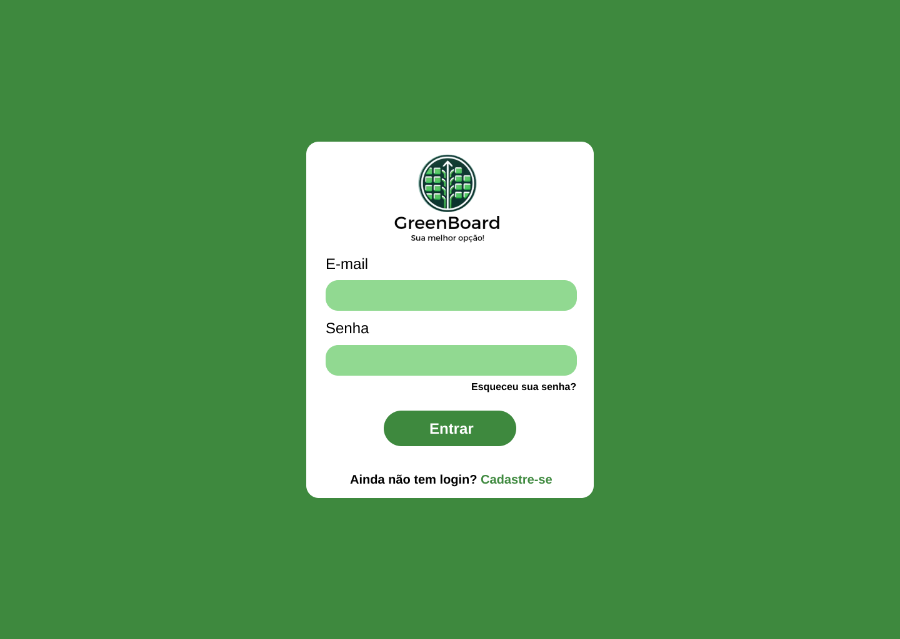
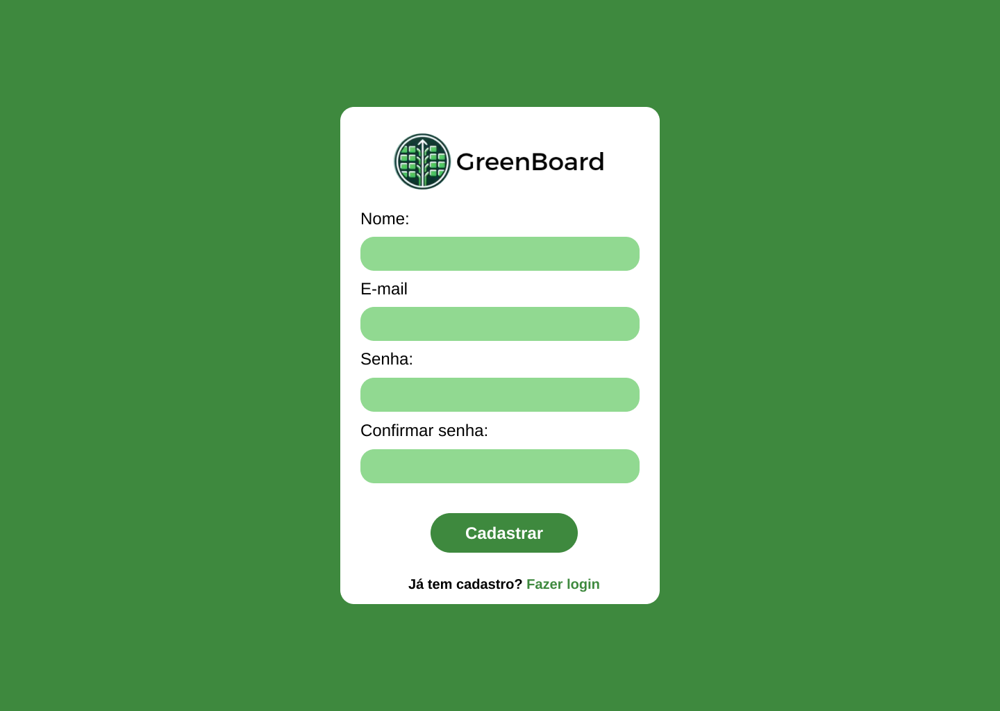
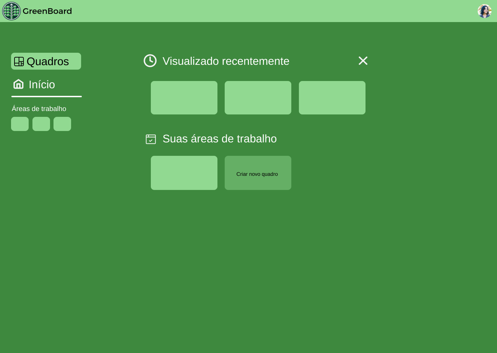
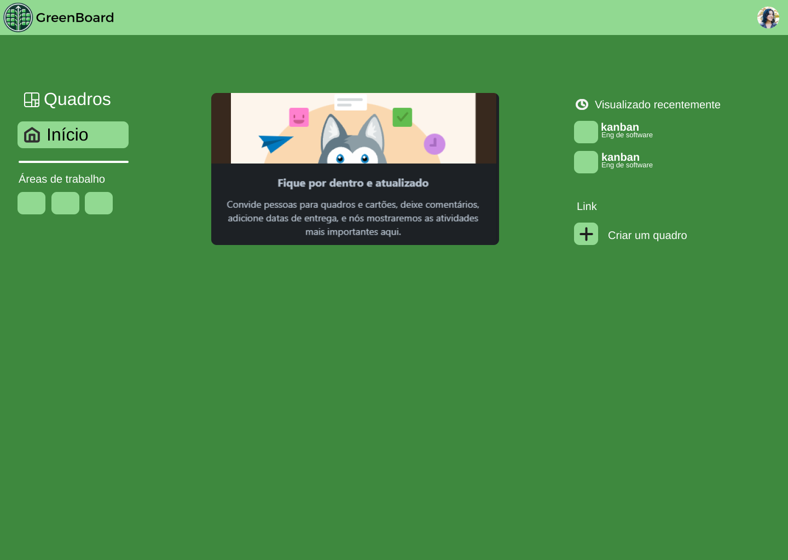
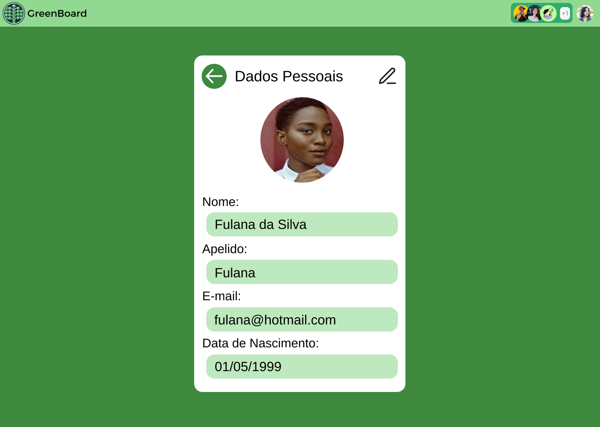

# User Stories

## US0 - Como um usuário do Green Board, quero poder adicionar cartões às listas ou novas listas.

### Descrição:
Como um(a) usuário(a) do Green Board, quero poder adicionar cartões às listas e novas listas, para isso vou clicar no botão de adicionar cartão ou lista, que vai mostrar uma entrada de texto para digitar o conteúdo do cartão ou da lista e apertarei o botão de salvar para salvar as mudanças.

### Regras de negócio:
* Seja possível adicionar novos cartões e listas.

### Observações:
N/A

### Dados:
* Conteúdo do cartão/Título da lista.

### Protótipo
#### Adicionar cartão:

#### Adicionar lista:

## US1 - Como um usuário do Green Board, eu quero poder editar os detalhes de um cartão ou de uma lista.

### Descrição:
Como um(a) usuário(a) do Green Board, eu quero poder editar os detalhes de um cartão, para isso vou clicar no botão de editar que apresentará uma entrada de texto que me permite modificar o conteúdo do cartão.

### Regras de negócio:
* Seja possível editar novos cartões e listas.

### Observações:
N/A

### Dados:
* Conteúdo novo do cartão/Título novo da lista.

### Protótipo
#### Editar cartão:

#### Editar lista:

## US2 - Como um usuário do Green Board, eu quero poder remover um cartão de uma lista ou uma lista.

### Descrição:
Como um(a) usuário(a) do Green Board, eu quero poder remover um cartão de uma lista ou uma lista, para isso vou clicar no botão de editar e depois no botão de remover o item.

### Regras de negócio:
* Seja possível remover cartões e listas existentes.

### Observações:
N/A

### Dados:
* Cartão/Lista a ser removido.

### Protótipo
#### Remover cartão:

#### Remover lista:

## US3 - Como usuário, eu quero poder lêr cartões e listas adicionados em outras sessões.

### Descrição:
Como usuário, eu quero poder lêr cartões e listas adicionados em outras sessões, para isso preciso somente entrar no quadro que existia anteriormente.

### Regras de negócio:
* Seja possível abrir o mesmo quadro novamente e nele estar tudo que fora feito anteriormente.

### Observações:
N/A

### Dados:
* Cartões e listas de um quadro.

### Protótipo
#### Quadro:

## US4 - Como usuário, eu quero poder mudar a posição relativa de cartões e listas.

### Descrição:
Como usuário, eu quero poder mudar a posição relativa de cartões e listas, para isso clicarei num item e o arrasterei para o nova posição.

### Regras de negócio:
* Seja possível mudar a posição de cartões e listas.

### Observações:
* O usuário usará do mecanismo drag-n-drop para fazer isso.

### Dados:
* Cartão: nova lista e posição;
* Lista: nova posição.

## US5 - Como usuário, eu quero poder me autenticar e usar os recursos da plataforma.

### Descrição:
Como usuário, eu quero poder me autenticar e usar os recursos da plataforma, para isso inserirei minhas informações cadastrais em um formulário.

### Regras de negócio:
* Seja possível entrar como um usuário em especifíco.

### Observações:
N/A

### Dados:
* E-mail e senha.

### Protótipo
#### Login:

## US6 - Como usuário, quero poder me registrar na plataforma para usar seus recursos.

### Descrição:
Como usuário, quero poder me registrar na plataforma para usar seus recursos, para isso escreverei meus dados num formulário.

### Regras de negócio:
* Seja possível cadastrar um usuário na plataforma.

### Observações:
N/A

### Dados:
* Nome do usuário, e-mail e senha.

### Protótipo
#### Cadastro:

## US7 - Como usuário, quero poder recuperar minha senha caso a tenha esquecido.

### Descrição:
Como usuário, quero poder recuperar minha senha caso a tenha esquecido, para isso colocarei meu e-mail num formulário e receberei um e-mail que me permite ir na página de criar nova senha.

### Regras de negócio:
* Seja possível ao usuário mudar de senha caso necessário.

### Observações:
N/A

### Dados:
* E-mail.

### Protótipo
#### Recuperação de senha:

## US8 - Como líder do time, eu quero poder convidar outros membros da equipe ao quadro.

### Descrição:
Como usuário, eu quero poder convidar outros membros da equipe ao quadro, para isso digitarei seus nomes ou e-mails num formulário.

### Regras de negócio:
* Seja possível adicionar novos membros ao quadro.

### Observações:
N/A

### Dados:
* E-mail ou nome do usuário a ser adicionado.

### Protótipo
#### Convidar membros a um quadro:

## US9 - Como usuário, quero poder criar ou remover quadros ligados a mim.

### Descrição:
Como usuário, quero poder criar ou remover quadros ligados a mim, para isso acessarei uma tela que me mostre todos os meus quadros e que me permita adicionar ou remover um quadro.

### Regras de negócio:
* Seja possível criar ou remover quadros.

### Observações:
N/A

### Dados:
* Quadro removido ou criado.

### Protótipo
#### Manipulação de quadros:

## US10 - Reconfigurar Apache.

### Descrição:
Como hosteador do serviço, quero que as regras de configuração do servidor Apaches sejam seguras e sólidas, tal que o hosteamento fique mais fácil.

### Regras de negócio:
* Seja possível criar ou remover quadros.

### Observações:
N/A

### Dados:
N/A

## US11 - Como desenvolvedor, quero refatorar listas e cartões para seguir MVC e melhorar a organização.

### Descrição:
Como desenvolvedor, eu quero refatorar o código das listas e cartões para seguir os princípios MVC para que a aplicação seja mais organizada, escalável e fácil de manter.

### Regras de negócio:
* Seguir o padrão MVC para garantir organização, escalabilidade e facilidade de manutenção.

### Observações:
N/A

### Dados:
N/A

### Protótipo
#### Manipulação de quadros:

## US12 - Como usuário, quero poder criar ou remover quadros ligados a mim.

### Descrição:
Como usuário, quero acessar uma tela que me mostre todos os meus quadros e que me permita adicionar ou remover um quadro para organizar minhas atividades de forma eficiente.

### Regras de negócio:
* O usuário deve ser capaz de criar novos quadros.
* O usuário deve ser capaz de remover quadros existentes.
* Os quadros criados devem ser vinculados ao usuário que os criou.
* Apenas o dono do quadro pode removê-lo.

### Critérios de aceitação:
* O sistema deve exibir uma lista de todos os quadros vinculados ao usuário.
* O botão "Criar Quadro" deve estar disponível na interface para que o usuário adicione um novo quadro.
* Ao remover um quadro, o sistema deve solicitar uma confirmação antes de excluí-lo permanentemente.
* O sistema deve garantir que, ao remover um quadro, todas as informações associadas a ele sejam excluídas corretamente.

### Observações:
N/A

### Dados:
* Quadro removido ou criado.

### Protótipo
#### Manipulação de quadros:

## US13 - Como um usuário do GreenBoard, quero poder acessar e editar minhas informações pessoais na tela de perfil, para manter meus dados atualizados.

### Descrição:
Como um usuário do Green Board, quero ter acesso a uma tela de perfil onde poderei visualizar e editar minhas informações pessoais, como nome, e-mail e foto de perfil. Isso me permitirá atualizar meus dados sempre que necessário.

### Regras de negócio:
* O usuário poderá visualizar e editar sua foto de perfil, nome completo, apelido, E-amil e data de nascimento.

### Observações:
N/A

### Dados:
* Nome e E-maiL.
  
### Protótipo
#### Editar Perfil:

## US15 - Adicionar usuário a um cartão.

### Descrição:
Como usuário, quero poder me adicionar a um cartão, para isso clicarei num botão que me adicionará ao cartão, mostrando meu icone nele.

### Regras de negócio:
* Seja possível adicionar um usuário a um cartão.

### Observações:
N/A

### Dados:
* Quais e quantos usuários estão em cada cartão.

## US14 - Como desenvolvedor, quero refatorar usuários para seguir Model-View-Controller (MVC) para melhor organização.

### Descrição:
Como desenvolvedor, eu quero refatorar os usuários seguindo os princípios MVC para que a aplicação seja mais organizada, entendível e fácil de manter.

### Regras de negócio:
Seguir o padrão MVC para garantir organização e facilidade no entendimento e na manutenção.

### Observações:
N/A

### Dados:
N/A
